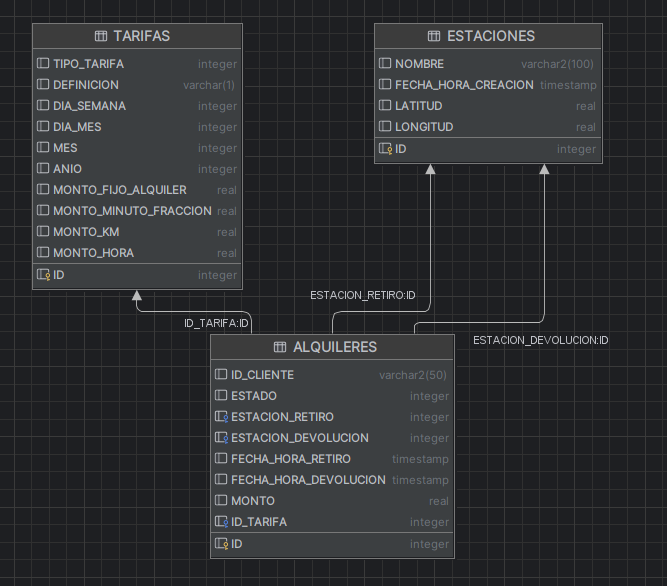
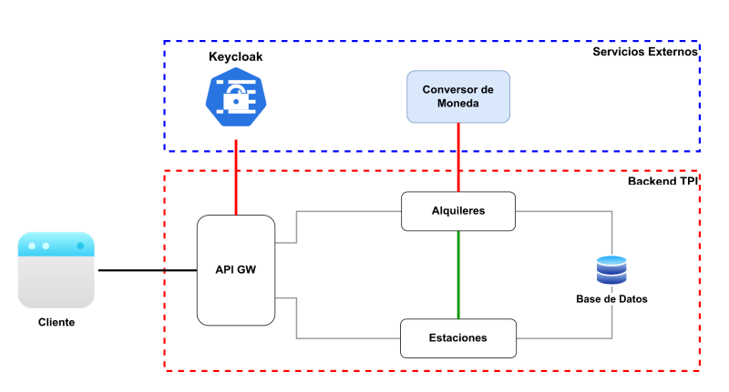

# API Alquiler Bicicletas PPAI

## Tabla de Contenido
1. [Información General](#InformacionGeneral)
2. [Objetivo](#Objetivo)
3. [Tecnologías](#Tecnologias)
4. [Alcances](#Alcances)
5. [Imágenes Referenciales](#ImagenesReferenciales)

### Información General
Proyecto práctico aplicado integrador grupal con Java. Desarrollo de un backend compuesto por microservicios que exponen un API REST (con representación en JSON) para gestionar un sistema de alquiler de bicicletas en una ciudad.

### Objetivo
Desarrollar un sistema que permita a clientes registrados alquilar bicicletas, gestionar estaciones, iniciar y finalizar alquileres, calcular costos y obtener información sobre estaciones, entre otras funcionalidades.

## Tecnologías
* Base de datos: SQL Server
* Entorno de desarrollo: NetBeans
* Lenguaje de Programacion: JAVA
* API Gateway: Spring Cloud Gateway
* Framework para API REST: Spring Boot
  
### Alcances
* Consultar el listado de todas las estaciones disponibles en la ciudad.
* Consultar los datos de la estación más cercana a una ubicación proporcionada por el cliente.
* Iniciar el alquiler de una bicicleta desde una estación dada.
* Finalizar un alquiler en curso, informando los datos del mismo y el costo expresado en la moneda que el cliente desee.
* Agregar una nueva estación al sistema.
* Obtener un listado de los alquileres realizados aplicando un filtro.

### Imágenes Referenciales

#### Diagrama de la base de datos

#### Esquema ilustrativo de la organizacion de servicios
